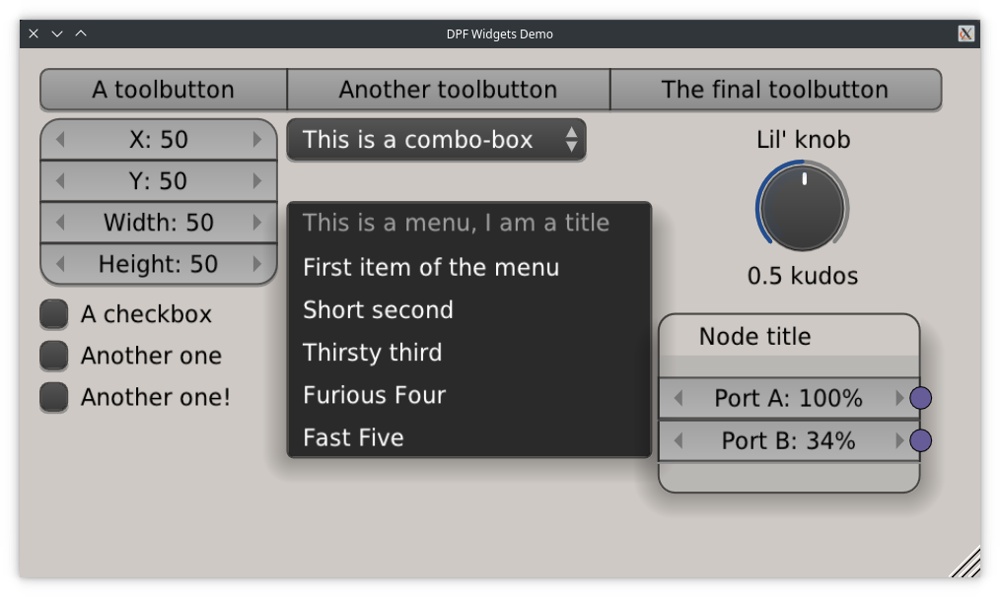
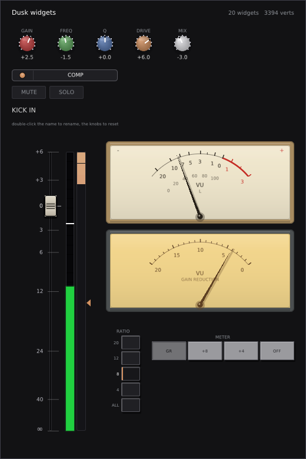

# DAF Widgets
## Reusable GUI widgets for [DAF](https://github.com/dusk-audio/DAF), the Dusk Audio Framework

**This is a fork of [DISTRHO/DPF-Widgets](https://github.com/DISTRHO/DPF-Widgets) by Filipe Coelho
and contributors.** Most of the code here is theirs and it is very good. The fork exists so that
[Dusk Audio](https://github.com/dusk-audio) builds pin one tree they control alongside
[DAF](https://github.com/dusk-audio/DAF). If you are building on DPF, use DISTRHO's original.

On top of upstream this tree carries an MSVC compatibility fix, a handful of Dear ImGui
integration fixes (telling ImGui when the window focus changes, releasing the graphics context in
the standalone constructor, keeping non-finite values out of the draw list, and clearing key state
on focus loss without cancelling a drag in progress), and one widget set of its own,
`opengl/DuskWidgets`, described under Status below.

Renamed from DPF-Widgets to DAF-Widgets in August 2026 so that two identically named repositories
stop sending people and tooling to the wrong tree. The name marks whose checkout this is, not
whose work it is. Original copyright notices and licence terms are retained in every file.

Development here is one-way in both directions: nothing is submitted to DISTRHO, and no DISTRHO
commit is merged back in. Report bugs on the
[dusk-audio/DAF-Widgets issue tracker](https://github.com/dusk-audio/DAF-Widgets/issues).

---

This is a repository for shared GUI widgets targetting [DAF](https://github.com/dusk-audio/DAF)
(and, upstream, [DPF](https://github.com/DISTRHO/DPF/)).

Since [DAF](https://github.com/dusk-audio/DAF) allows multiple backends (cairo, opengl or vulkan), we need to split them as such.
Each folder provides widgets for its dedicated backend type.
It is not mandatory that a widget is usable for more than 1 backend.
Generic widgets (those based on DAF core classes like Color, Rectangle, etc) are placed under the "generic" directory.

## Status

#### generic / ResizeHandle

Resize handle for DAF windows, will sit on bottom-right.

Works in both Cairo and OpenGL modes (classic/legacy OpenGL only, does not support OpenGL3 mode).

Used very often and in many plugins.

---

#### generic / LVGL

Exposes the [LVGL](https://github.com/lvgl/lvgl) drawing API inside a DGL Widget.
This class will take care of setting up LVGL for drawing, and also user input, resizes and everything in between.

See [lvgl-template-plugin](https://github.com/DISTRHO/lvgl-template-plugin/) for a CMake-based template plugin project around LVGL.

---

#### opengl / Blendish

[oui-blendish](https://github.com/VCVRack/oui-blendish) widgets for DPF.
Work in progress, usable in very select cases.

Used in:

- [AIDA-X](https://github.com/AidaDSP/AIDA-X/) (standalone options)

---

#### opengl / DearImGui

Exposes the [Dear ImGui](https://github.com/ocornut/imgui/) drawing API inside a DGL Widget.
The drawing function `onDisplay()` is implemented internally but a new `onImGuiDisplay()` needs to be overridden instead.
This class will take care of setting up ImGui for drawing, and also also user input, resizes and everything in between.

Used in:

- [dear-plugins](https://github.com/DISTRHO/dear-plugins)
- [Ildaeil](https://github.com/DISTRHO/Ildaeil)
- [master_me](https://github.com/trummerschlunk/master_me/) (histogram display)
- [WSTD CRSHR](https://github.com/Wasted-Audio/wstd-crshr)
- [WSTD DLAY](https://github.com/Wasted-Audio/wstd-dlay)
- [WSTD DL3Y](https://github.com/Wasted-Audio/wstd-dl3y)
- [WSTD EQ](https://github.com/Wasted-Audio/wstd-eq)
- [WSTD 3Q](https://github.com/Wasted-Audio/wstd-3q)
- [WSTD FLANGR](https://github.com/Wasted-Audio/wstd-flangr)
- [WSTD FL3NGR](https://github.com/Wasted-Audio/wstd-fl3ngr)
- [WSTD FLDR](https://github.com/Wasted-Audio/wstd-fldr)
- [WSTD MANGLR](https://github.com/Wasted-Audio/wstd-manglr)
- [WSTD M3NGLR](https://github.com/Wasted-Audio/wstd-m3nglr)
- [WSTD SMTHR](https://github.com/Wasted-Audio/wstd-smthr)

See [imgui-template-plugin](https://github.com/DISTRHO/imgui-template-plugin/) for a CMake-based template plugin project around ImGui.
See [imgui-template-app](https://github.com/DISTRHO/imgui-template-app/) for a standalone application template.

---

#### opengl / DearImGuiColorTextEditor

Text Editor Widget class, based on [ImGuiColorTextEdit](https://github.com/BalazsJako/ImGuiColorTextEdit/).

Used in:

- [dear-plugins](https://github.com/DISTRHO/dear-plugins)

---

#### opengl / Quantum

[Quanta](https://forum.cockos.com/showthread.php?t=269437)-inspired widgets for DPF.

Used in:

- [master_me](https://github.com/trummerschlunk/master_me/)

---

#### opengl / DuskWidgets

The mixing-console widget set shared by Dusk Studio and the Dusk plug-in UIs: the knob with its
pre-rendered dome, the full-travel fader, the segmented meter, the gain-reduction column, the
analogue needle meter, the latching button bank, the module header pill, buttons, the drag value
bubble and the text field, plus the theme, the font baking and the shared value formatting.

It is the exception to the rules below on purpose. The set is a namespace of free functions taking
an `ImDrawList` and a `Context`, not a `SubWidget` subclass, so that a host which already has a Dear
ImGui context can draw with it whatever windowing it runs on: Dusk Studio uses it outside DGL
entirely. It depends on Dear ImGui only.

**`opengl/DuskWidgets.cpp` has to be compiled**, alongside `opengl/DearImGui.cpp`. Including the
header alone links only for the parts that are inline, which is none of the widgets. A CMake
consumer adds it to the same source list its ImGui backend is in; the gallery under `tests/` is a
worked example of the whole set, including the two calls the baked knob dome needs around
`ImFontAtlas::Build()`.

Values go in and come back out: a widget never writes through a pointer, so the caller decides
whether a parameter lives in an atomic, in a host parameter or in a plain float.

Being adopted by Dusk Studio and the Dusk plug-in fleet, which reached the same widgets
independently and are converging on this copy.

---

## Rules and Layout

Each widget MUST follow these rules:

 1. contain exactly 1 header file, with hpp extension
 2. must subclass SubWidget (for cairo use CairoSubWidget, nanovg should use NanoSubWidget) or TopLevelWidget
 3. widget name must match filename
 4. must have DISTRHO_DECLARE_NON_COPYABLE_WITH_LEAK_DETECTOR(ClassName) at the end of its class definition
 5. filenames must avoid generic terms such as widget
 6. contain 0 or 1 implementation files, with cpp extension and same basename as the matching hpp file
 7. optionally contain extra files, directly included from the cpp file
 8. place any extra files under a directory with the same basename as the cpp file, minus the file extension
 9. try to be self-contained, not needing externally installed dependencies (besides the locally available extra files defined in the previous point)
10. be contained within DGL_NAMESPACE
11. have clear documentation specifying its use
12. be cross-platform (win32 and posix)
13. be liberally licensed (the same way as DPF or with a compatible license allowing commercial use)

Coding style rules yet to be defined.
